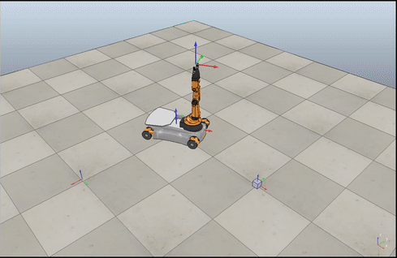
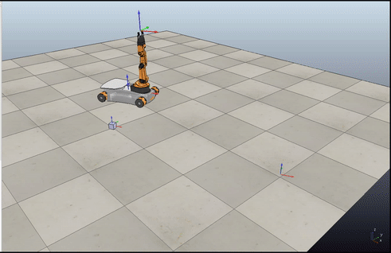
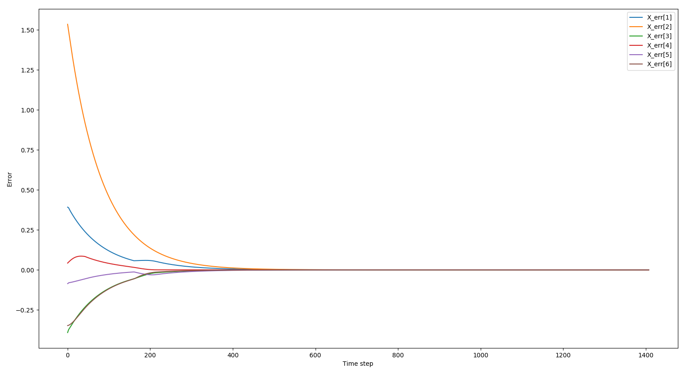
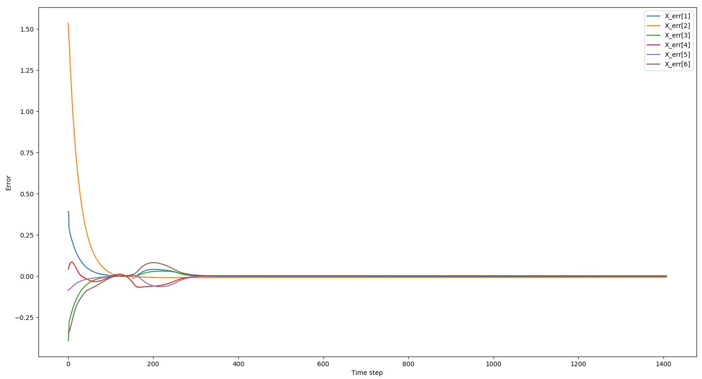

# KUKA youBot Manipulation
#### ME-449 Final Project, Northwestern University
-----------------------------------------------------------------------------------------

## Introduction
This is the final project of course [ME-449 Robotic Manipulation](http://hades.mech.northwestern.edu/index.php/ME_449_Robotic_Manipulation) at Northwestern University.

The goal of this project is to drive the KUKA youBot to pick up a block at the start location and carry it to the desired location in the simulation software V-REP. The project covers the following topics:
1. Plan the reference trajectory of the end-effector from start point to end point
2. Generate the kinematics model of the youBot, consisting of the mobile base with 4 mecanum wheels and the robot arm with 5 joints
3. Apply feedforward + PI controller to drive the robot to converge to the reference trajectory
4. Conduct the simulations in V-REP

## Usage
This project uses the following software:
* Python
* [Modern Robotics Library](https://github.com/NxRLab/ModernRobotics)
* [V-REP](http://www.coppeliarobotics.com/)
* [V-REP Scene 6](http://hades.mech.northwestern.edu/index.php/V-REP_Introduction#Demonstration_V-REP_Scenes)

Due to confidential issues, the source codes are not committed to this repo.

## Result
### 1. Videos of two different tasks

  

  

### 2. Performance of different feedforward + PI controllers
The following two images are the plots of the six elements of end-effector error twist along with time:
1. Kp = 1.2, Ki = 0: This controller gives the perfect motion of the robot. The motion is smooth and converges fast without overshooting.

  

2. Kp = 4.0, Ki = 0.1: The proportional gain is larger thus the error converges to zero faster than the previous controller. However, the error demonstrates overshoot at the beginning.

  

## Implementation

### 1. full_program.py
This is the main program of this project. It imports modules from the three python scripts:
* **reference_trajectory_generation.py**
* **kinematics_simulator.py**
* **task_space_control.py**

It takes the following inputs from the user:
* The initial and final configurations of the cube object: **cube_initial, cube_final**
* The actual and reference configurations of the youBot: **youbot_actual, youbot_ref**
* The proportional and integral gains of the control algorithm: **Kp, Ki**

The two outputs are:
* **V-REP.csv** : A list of wheel and joint angles of the youBot at each time step. Import this file into V-REP scene 6 and start the simulation.
* **error.csv** : A list of error twists between the reference and actual poses of the end effector at each time step. Run **error_plot.py** to generate the error plot.

The program operates as follows:
1. Generate the reference trajectory of the youbot given the configurations of the cube and youbot

2. In a loop:

 a. Conduct the control algorithm to generate the joint and wheel velocities to the robot according to the reference trajectory

 b. Compute the kinematics of the youbot to calculate the updated robot configuration as the actual configuration

### 2. error_plot.py
This code takes the output **error.csv** from the **full_program.py**, and plot the six elements of the error twist X_err.

### 3. reference_trajectory_generation.py
This code generates the reference trajectory of the youbot. It take the reference initial configuration of the youBot as weel as the cube initial and final configurations, generates a set of se(3) points at each timestep. The trajectory is constant screw motion paths.

The pick-and-place process has eight steps:
1. A trajectory to move the gripper from its initial configuration to a "standoff" configuration a few cm above the block.
2. A trajectory to move the gripper down to the grasp position.
3. Closing of the gripper.
4. A trajectory to move the gripper back up to the "standoff" configuration.
5. A trajectory to move the gripper to a "standoff" configuration above the final configuration.
6. A trajectory to move the gripper to the final configuration of the object.
7. Opening of the gripper.
8. A trajectory to move the gripper back to the "standoff" configuration.

### 4. kinematics_simulator.py
This code computes the kinematics of the odometry. It works as follows:
1. Take the velocities from **task_space_control.py**
2. Calculate the configuration of the robot at each timestep (transform the wheel positions to robot base configuration)
3. Make the calculated configurations as the actual robot configuration assuming there is no error in the robot sensing system

### 5. task_space_control.py
This code applies the feed-forward plus PI control law to generate joint and wheel velocities to drive the youBot catch up with the reference trajectory.

It has three parts:
1. Function **task_space_control()** conducts the control law to compute the end-effector twist V
2. Function **jacobian_pseudoinverse()** generates the mobile manipulator Jacobian J_e
3. The pseudoinverse of J_e times the end-effector twist V gives the desired joint and wheel velocities
